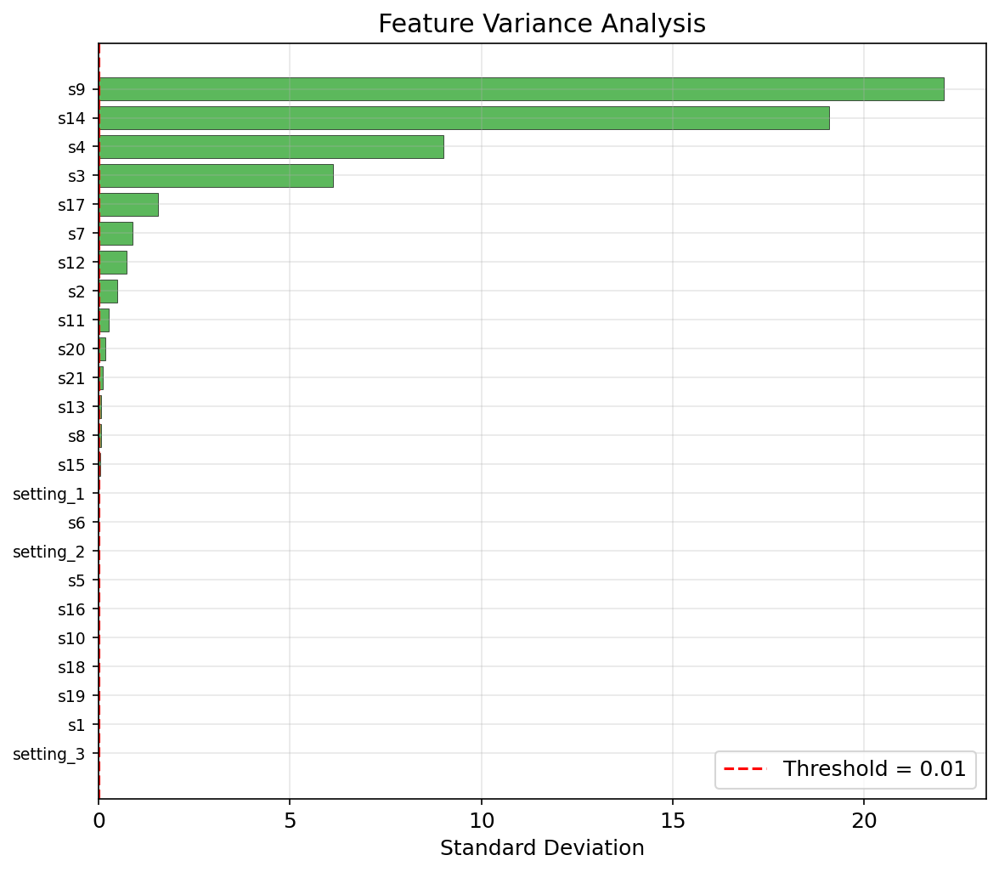
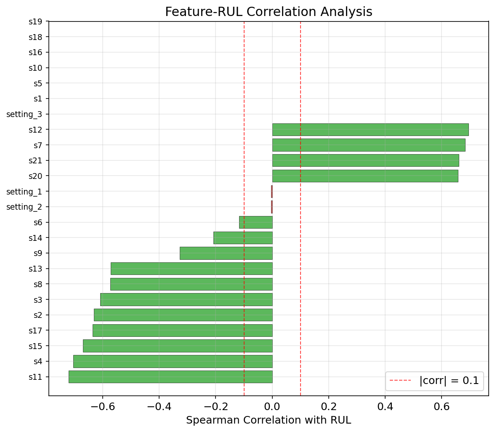
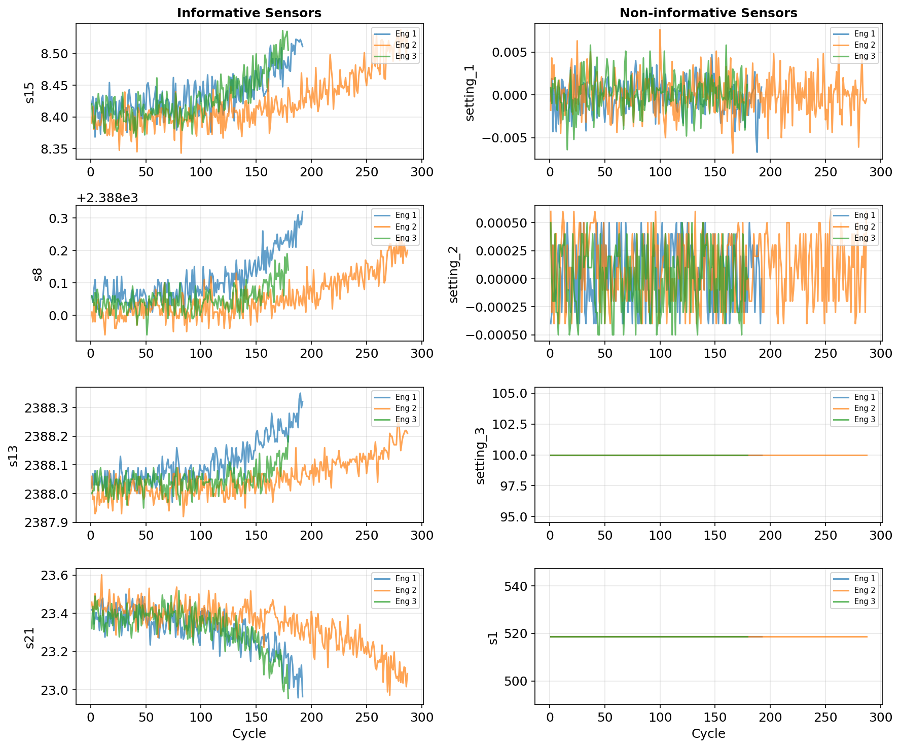
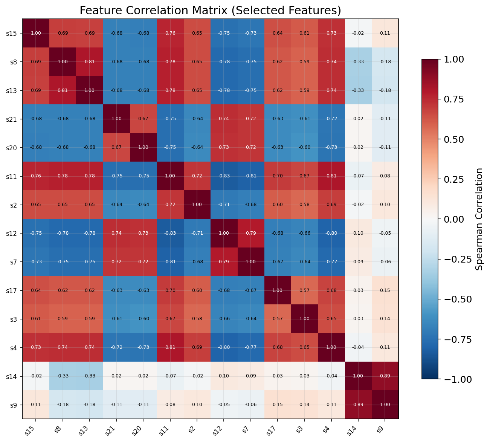

[English](#english) | [中文](#中文)

---

<a id="中文"></a>

# 概率 RUL 预测与不确定性量化

## 项目简介

本项目实现了一个**概率 LSTM** 模型，用于预测涡轮风扇发动机的**剩余使用寿命（RUL）**，并内置**不确定性量化**功能。该项目为 UCL COMP0197 Applied Deep Learning 课程作业。

模型输出高斯分布参数（均值 μ 和标准差 σ）而非单一点估计，并使用 **MC Dropout** 将预测不确定性分解为：

- **偶然不确定性（Aleatoric）** — 数据固有噪声，通过学习的异方差方差头捕获
- **认知不确定性（Epistemic）** — 模型不确定性，通过 MC Dropout 采样捕获

## 数据集

**NASA C-MAPSS（商用模块化航空推进系统仿真）— FD001 子集**

| 属性 | 值 |
|------|-----|
| 训练轨迹 | 100 台发动机（完整退化至故障） |
| 测试轨迹 | 100 台发动机（在故障前截断） |
| 运行条件 | 1 种（海平面） |
| 故障模式 | 1 种（HPC 退化） |
| 每时间步传感器数 | 21 个传感器 + 3 个运行设置 |
| 选用特征数 | 14 个（两阶段数据驱动筛选） |

每行包含 26 列空格分隔数据：`unit_id`、`cycle`、3 个运行设置和 21 个传感器读数。RUL 标签采用分段线性方法构造，上限截断为 125 个周期。运行 `train.py` 时数据集会从 NASA 开放数据门户自动下载。

## 模型架构

### 概率 LSTM（主模型）

- 2 层 LSTM 编码器（隐藏层 128 维），层间带 Dropout
- 两个并行输出头：**μ**（均值）和 **σ**（标准差），通过 `exp(log_sigma) + 1e-6` 保证正值
- 使用**高斯负对数似然损失（Gaussian NLL Loss）** 训练
- 测试时进行 **T=100 次 MC Dropout 前向传播**以估计认知不确定性

### 确定性 LSTM（基线模型）

- 相同 LSTM 架构，单输出头
- 使用 **MSE 损失**训练
- 用于消融实验对比

### 超参数

| 参数 | 值 |
|------|-----|
| 序列长度 | 30 |
| 隐藏层维度 | 128 |
| LSTM 层数 | 2 |
| Dropout 比率 | 0.25 |
| 学习率 | 0.001（Adam, weight decay 1e-4） |
| 批大小 | 32 |
| R_early（RUL 上限） | 125 |
| 学习率调度 | ReduceLROnPlateau（factor=0.5, patience=5） |
| 早停耐心值 | 20 |
| MC Dropout 采样次数 | 100 |
| 梯度裁剪 | max_norm=1.0 |

## 数据探索与特征选择

特征选择采用两阶段数据驱动方法（见下图）：

1. **方差过滤**：移除近常量特征（std < 0.01），去除 10 个无信息量的传感器/设置
2. **相关性过滤**：保留与 RUL 的 |Spearman 相关系数| > 0.1 的特征，最终保留 14 个传感器

| 特征方差分析 | 特征-RUL 相关性分析 |
|:-----------:|:------------------:|
|  |  |

最强相关特征：s11（ρ = −0.72）、s4（−0.70）、s12（+0.70）。

| 信息量传感器 vs 无信息量传感器对比 | 选定特征间相关性矩阵 |
|:-------------------------------:|:------------------:|
|  |  |

## 评估指标说明

### 点预测指标

| 指标 | 全称 | 含义 | 方向 |
|------|------|------|------|
| **RMSE** | Root Mean Squared Error | 预测误差的均方根，对大误差更敏感 | 越低越好 |
| **MAE** | Mean Absolute Error | 预测误差的平均绝对值，反映整体偏差 | 越低越好 |
| **R²** | Coefficient of Determination | 模型解释目标变量方差的比例，1.0 表示完美拟合 | 越高越好 |
| **NASA Score** | NASA Scoring Function | PHM 领域专用非对称评分函数：迟预测（预测 RUL < 真实 RUL，即高估健康状态）的惩罚远大于早预测，因为迟预测可能导致未提前维护的灾难性故障。公式：$S = \sum_i (e^{d_i/a} - 1)$，其中 $d_i = \hat{y}_i - y_i$，迟预测 $a=13$，早预测 $a=10$ | 越低越好 |

### 不确定性质量指标

| 指标 | 全称 | 含义 | 方向 |
|------|------|------|------|
| **PICP** | Prediction Interval Coverage Probability | 95% 置信区间内包含真实值的样本比例。理想值为 0.95，过高说明区间过宽（保守），过低说明过窄（过度自信） | 接近 0.95 |
| **MPIW** | Mean Prediction Interval Width | 95% 置信区间的平均宽度（单位：周期）。在 PICP 达标的前提下越窄越好 | 越低越好 |
| **NLL** | Negative Log-Likelihood | 模型预测分布对真实值的负对数似然，综合衡量预测的准确性和不确定性校准 | 越低越好 |

## 实验结果

### 点预测指标

| 模型 | RMSE | MAE | R² | NASA 评分 |
|------|------|-----|-----|----------|
| **概率 LSTM** | **14.84** | **11.08** | **0.872** | **351.07** |
| 确定性 LSTM | 14.96 | 11.12 | 0.870 | 424.06 |

概率模型的 NASA 评分降低 17%（351 vs 424），因 NLL 损失隐式正则化了预测，减少了高代价的迟估计。

### 不确定性质量指标（概率 LSTM）

| 指标 | 值 |
|------|-----|
| PICP（95% CI） | 0.93 |
| MPIW（95% CI） | 51.64 周期 |
| NLL | 3.02 |
| 平均偶然不确定性标准差 | 12.33 |
| 平均认知不确定性标准差 | 4.38 |
| 平均总不确定性标准差 | 13.17 |

偶然不确定性占总方差约 88%（std 12.33 vs 认知 4.38），表明数据噪声而非模型容量是预测不确定性的主要来源。

### 可视化结果

#### 传感器退化趋势


4 台发动机的关键传感器随运行周期的变化。传感器读数在寿命末期出现明显退化趋势。

#### 训练曲线

| 概率 LSTM | 确定性 LSTM |
|:---------:|:----------:|
|  |  |

两者训练/验证曲线贴合良好，无明显过拟合。概率模型 epoch 49 早停，确定性模型 epoch 44 早停。

#### RUL 预测 vs 真实值

| 概率 LSTM | 确定性 LSTM |
|:---------:|:----------:|
|  |  |

低 RUL 区域预测准确，高 RUL 区域散布较大，受限于 R_early=125 截断标签。

#### 带不确定性的预测


95% 置信区间在低 RUL 处窄（模型有信心），在高 RUL 处宽（模型不确定）。绝大多数真实值落在置信带内。

#### 不确定性分解


橙色带为偶然不确定性（数据噪声），绿色带为认知不确定性（模型不确定性）。偶然不确定性占主导。

#### 校准曲线


实际覆盖率紧贴期望覆盖率对角线，说明模型的不确定性估计校准良好。

#### 稀疏化图


移除高不确定性样本后 RMSE 持续下降，且趋势与 Oracle 一致，验证了不确定性估计与实际误差正相关。

#### 消融对比


概率模型在不牺牲点预测精度的前提下，额外获得了不确定性量化能力。

## 使用方法

```bash
# 环境配置
micromamba activate comp0197-pt

# 探索性数据分析
python eda.py

# 训练两个模型
python train.py

# 评估并生成图表
python test.py
```

所有脚本使用 `argparse`，无需额外参数即可运行。

## 项目结构

```
├── train.py              # 训练流程（下载、预处理、训练、保存）
├── test.py               # 评估流程（MC Dropout 推理、指标计算、绘图）
├── eda.py                # 探索性数据分析（方差、相关性、特征对比、热力图）
├── models/
│   ├── probabilistic_lstm.py   # 概率 LSTM：(μ, σ) 输出 + Gaussian NLL
│   └── deterministic_lstm.py   # 确定性 LSTM：MSE 基线
├── utils/
│   ├── data_loader.py    # 数据下载、两阶段特征选择、滑动窗口、Dataset/DataLoader
│   ├── metrics.py        # RMSE、MAE、R²、NASA 评分、PICP、MPIW、NLL、校准
│   ├── visualization.py  # 所有 matplotlib 图表（8 种）
│   └── helpers.py        # EarlyStopping、随机种子设置
├── report/
│   └── main.tex          # LNCS 格式 LaTeX 论文
├── saved_models/         # 模型检查点（.pth）
├── results/
│   ├── figures/          # 生成的 PNG 图表（含 EDA 和模型评估）
│   └── metrics.json      # 量化结果
└── literature_review.md  # 文献综述
```

---

<a id="english"></a>

# Probabilistic RUL Prediction with Uncertainty Quantification

## Project Overview

This project implements a **Probabilistic LSTM** model for predicting the **Remaining Useful Life (RUL)** of turbofan engines, with built-in **uncertainty quantification**. It is developed as part of the UCL COMP0197 Applied Deep Learning coursework.

The model outputs Gaussian distribution parameters (mean μ and standard deviation σ) rather than a single point estimate, and uses **MC Dropout** to decompose predictive uncertainty into:

- **Aleatoric uncertainty** — inherent data noise, captured by a learned heteroscedastic variance head
- **Epistemic uncertainty** — model uncertainty, captured by MC Dropout sampling

## Dataset

**NASA C-MAPSS (Commercial Modular Aero-Propulsion System Simulation) — FD001 subset**

| Property | Value |
|----------|-------|
| Training trajectories | 100 engines (run-to-failure) |
| Test trajectories | 100 engines (truncated before failure) |
| Operating conditions | 1 (sea level) |
| Fault modes | 1 (HPC degradation) |
| Sensors per timestep | 21 sensors + 3 operational settings |
| Selected features | 14 (two-stage data-driven selection) |

Each row contains 26 space-separated columns: `unit_id`, `cycle`, 3 operational settings, and 21 sensor readings. RUL labels are constructed using a piece-wise linear scheme with an upper bound of 125 cycles. The dataset is automatically downloaded from NASA Open Data Portal when running `train.py`.

## Model Architecture

### Probabilistic LSTM (Main Model)

- 2-layer LSTM encoder (hidden dim 128) with inter-layer dropout
- Two parallel output heads: **μ** (mean) and **σ** (std) via `exp(log_sigma) + 1e-6`
- Trained with **Gaussian Negative Log-Likelihood Loss**
- At test time, runs **T=100 MC Dropout forward passes** to estimate epistemic uncertainty

### Deterministic LSTM (Baseline)

- Same LSTM architecture, single output head
- Trained with **MSE Loss**
- Used for ablation comparison

### Hyperparameters

| Parameter | Value |
|-----------|-------|
| Sequence length | 30 |
| Hidden dimension | 128 |
| LSTM layers | 2 |
| Dropout | 0.25 |
| Learning rate | 0.001 (Adam, weight decay 1e-4) |
| Batch size | 32 |
| R_early (RUL cap) | 125 |
| LR scheduler | ReduceLROnPlateau (factor=0.5, patience=5) |
| Early stopping patience | 20 |
| MC Dropout samples | 100 |
| Gradient clipping | max_norm=1.0 |

## Data Exploration & Feature Selection

Feature selection uses a two-stage data-driven approach (see figures below):

1. **Variance filter**: removes near-constant features (std < 0.01), eliminating 10 uninformative sensors/settings
2. **Correlation filter**: retains features with |Spearman correlation with RUL| > 0.1, keeping 14 sensors

| Variance Analysis | Feature-RUL Correlation |
|:-----------------:|:-----------------------:|
|  |  |

Strongest correlations: s11 (ρ = −0.72), s4 (−0.70), s12 (+0.70).

| Informative vs Non-informative Sensors | Selected Feature Correlation Matrix |
|:--------------------------------------:|:-----------------------------------:|
|  |  |

## Evaluation Metrics

### Point Prediction Metrics

| Metric | Full Name | Description | Direction |
|--------|-----------|-------------|-----------|
| **RMSE** | Root Mean Squared Error | Root mean square of prediction errors; more sensitive to large errors | Lower is better |
| **MAE** | Mean Absolute Error | Mean absolute prediction error; reflects overall bias | Lower is better |
| **R²** | Coefficient of Determination | Proportion of target variance explained by the model; 1.0 = perfect fit | Higher is better |
| **NASA Score** | NASA Scoring Function | Asymmetric scoring function from the PHM domain: late predictions (predicted RUL < true RUL, i.e., overestimating health) are penalised much more heavily than early predictions, since late predictions risk catastrophic undetected failures. Formula: $S = \sum_i (e^{d_i/a} - 1)$ where $d_i = \hat{y}_i - y_i$, with $a=13$ for late and $a=10$ for early predictions | Lower is better |

### Uncertainty Quality Metrics

| Metric | Full Name | Description | Direction |
|--------|-----------|-------------|-----------|
| **PICP** | Prediction Interval Coverage Probability | Fraction of true values falling within the 95% confidence interval. Ideal = 0.95; too high means overly wide (conservative) intervals, too low means overconfidence | Close to 0.95 |
| **MPIW** | Mean Prediction Interval Width | Average width of the 95% confidence interval (in cycles). Should be as narrow as possible while maintaining PICP | Lower is better |
| **NLL** | Negative Log-Likelihood | Negative log-likelihood of the true values under the predicted distribution; jointly measures prediction accuracy and uncertainty calibration | Lower is better |

## Results

### Point Prediction Metrics

| Model | RMSE | MAE | R² | NASA Score |
|-------|------|-----|-----|------------|
| **Probabilistic LSTM** | **14.84** | **11.08** | **0.872** | **351.07** |
| Deterministic LSTM | 14.96 | 11.12 | 0.870 | 424.06 |

The probabilistic model reduces the NASA Score by 17% (351 vs 424), as the NLL objective implicitly regularises predictions, reducing costly late estimates.

### Uncertainty Quality Metrics (Probabilistic LSTM)

| Metric | Value |
|--------|-------|
| PICP (95% CI) | 0.93 |
| MPIW (95% CI) | 51.64 cycles |
| NLL | 3.02 |
| Mean Aleatoric Std | 12.33 |
| Mean Epistemic Std | 4.38 |
| Mean Total Std | 13.17 |

Aleatoric uncertainty accounts for ~88% of total variance (std 12.33 vs epistemic 4.38), indicating data noise rather than model capacity is the primary source of predictive uncertainty.

### Visualisation

#### Sensor Degradation Trends


Key sensors across 4 engines over their operating cycles. Sensor readings exhibit clear degradation trends near end-of-life.

#### Training Curves

| Probabilistic LSTM | Deterministic LSTM |
|:-------------------:|:------------------:|
|  |  |

Both show well-matched train/val curves with no significant overfitting. Probabilistic model early-stopped at epoch 49, deterministic at epoch 44.

#### RUL Prediction vs Ground Truth

| Probabilistic LSTM | Deterministic LSTM |
|:-------------------:|:------------------:|
|  |  |

Low RUL predictions are accurate; high RUL predictions show more scatter, constrained by the R_early=125 clipping.

#### Predictions with Uncertainty Bands


95% confidence intervals are narrow at low RUL (high confidence) and wide at high RUL (high uncertainty). Most ground truth values fall within the bands.

#### Uncertainty Decomposition


Orange band = aleatoric (data noise), green band = epistemic (model uncertainty). Aleatoric dominates.

#### Calibration Plot


Actual coverage closely tracks expected coverage along the diagonal, demonstrating well-calibrated uncertainty estimates.

#### Sparsification Plot


Removing high-uncertainty samples consistently reduces RMSE, tracking the oracle curve, confirming predicted uncertainty correlates with actual error.

#### Ablation Comparison


The probabilistic model provides uncertainty quantification without sacrificing point prediction accuracy.

## Usage

```bash
# Environment setup
micromamba activate comp0197-pt

# Exploratory data analysis
python eda.py

# Train both models
python train.py

# Evaluate and generate figures
python test.py
```

All scripts use `argparse` with sensible defaults — no arguments needed.

## Project Structure

```
├── train.py              # Training pipeline (download, preprocess, train, save)
├── test.py               # Evaluation pipeline (MC Dropout inference, metrics, plots)
├── eda.py                # Exploratory data analysis (variance, correlation, comparison, heatmap)
├── models/
│   ├── probabilistic_lstm.py   # Probabilistic LSTM: (μ, σ) output + Gaussian NLL
│   └── deterministic_lstm.py   # Deterministic LSTM: MSE baseline
├── utils/
│   ├── data_loader.py    # Data download, two-stage feature selection, sliding window, Dataset/DataLoader
│   ├── metrics.py        # RMSE, MAE, R², NASA Score, PICP, MPIW, NLL, calibration
│   ├── visualization.py  # All matplotlib figures (8 plot types)
│   └── helpers.py        # EarlyStopping, seed setup
├── report/
│   └── main.tex          # LNCS-format LaTeX paper
├── saved_models/         # Model checkpoints (.pth)
├── results/
│   ├── figures/          # Generated PNG plots (EDA + model evaluation)
│   └── metrics.json      # Quantitative results
└── literature_review.md  # Literature review
```
