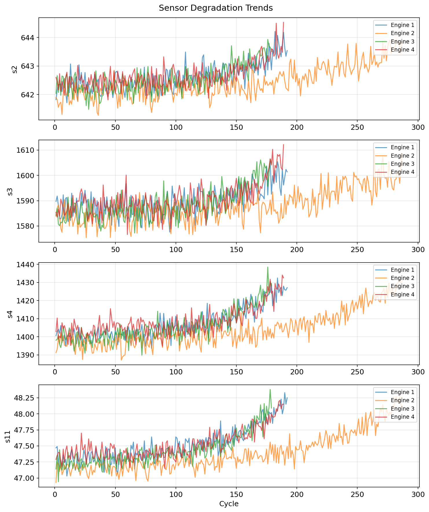
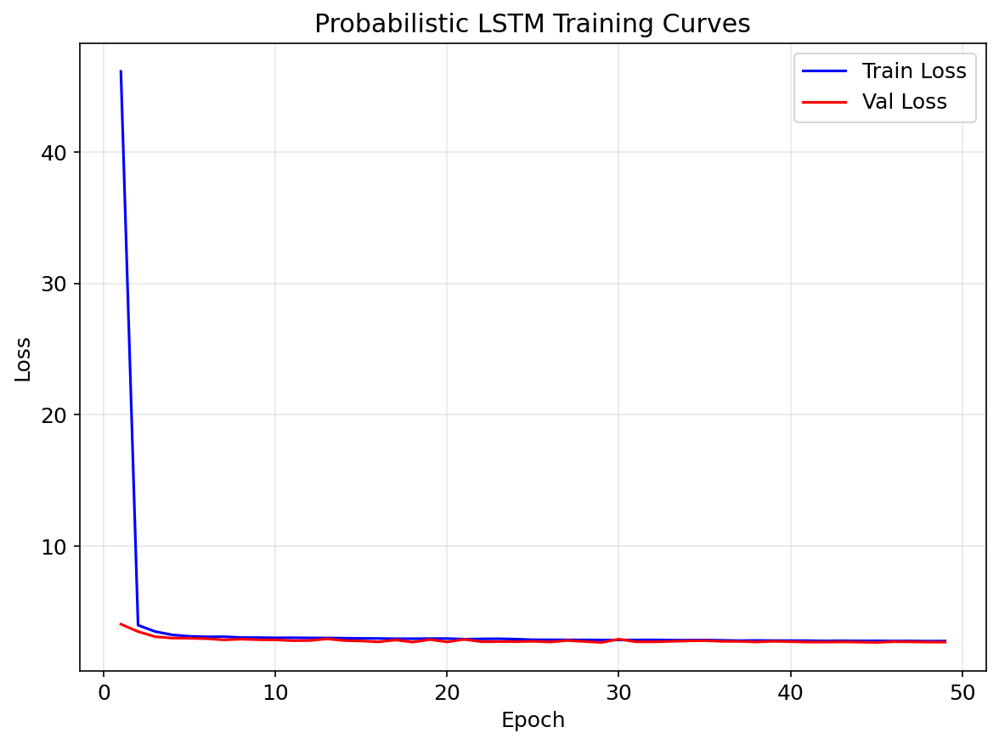
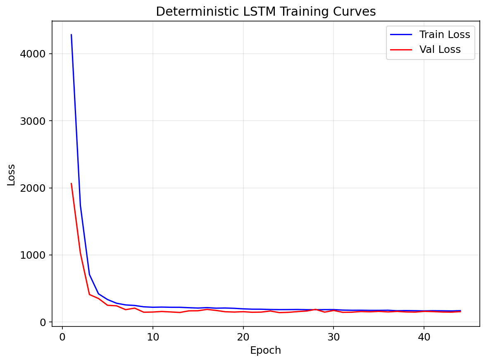
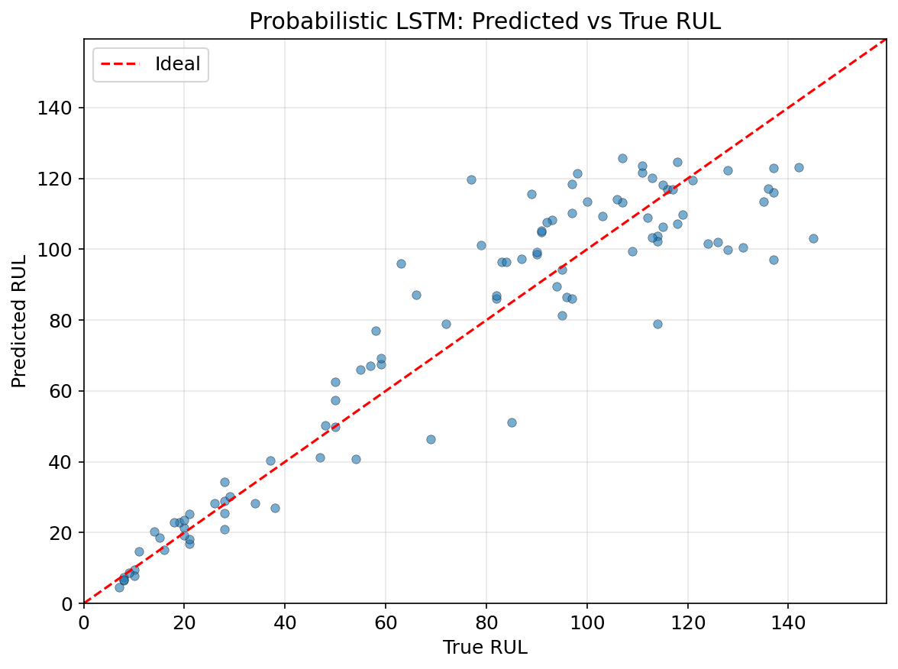
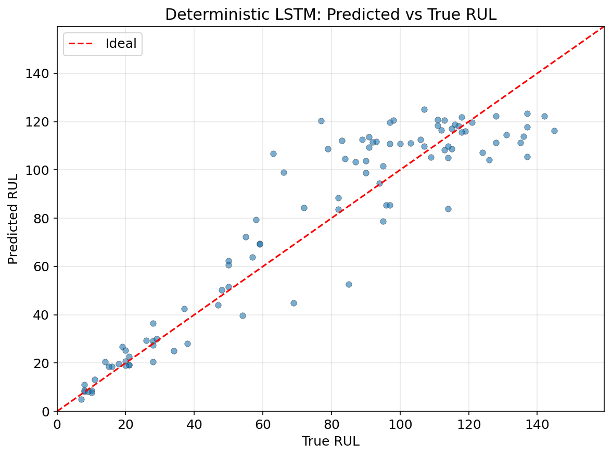
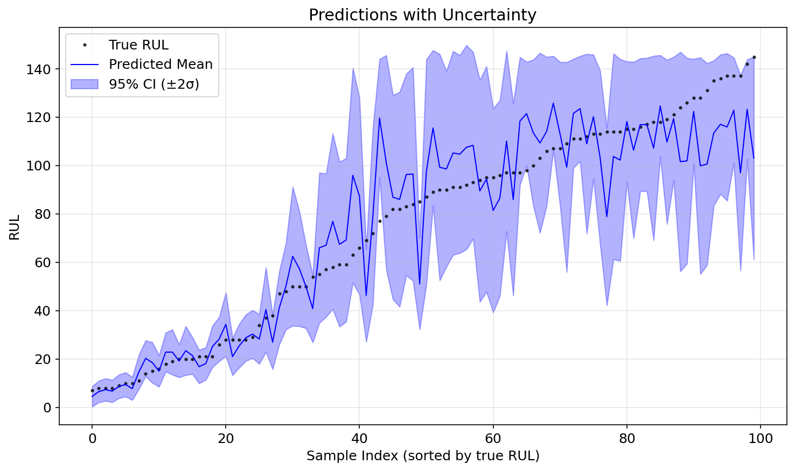
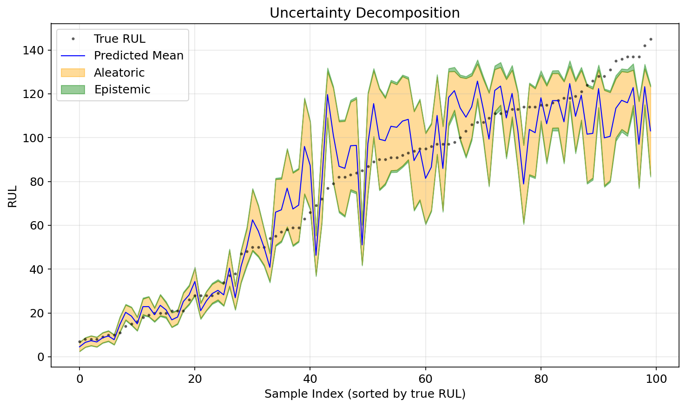
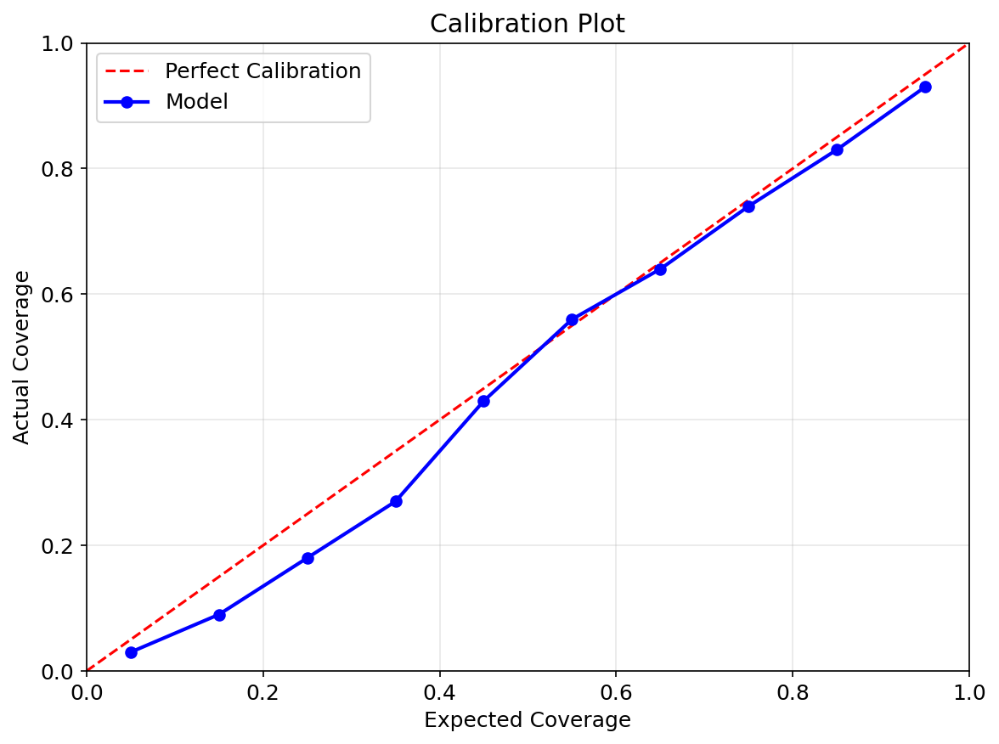
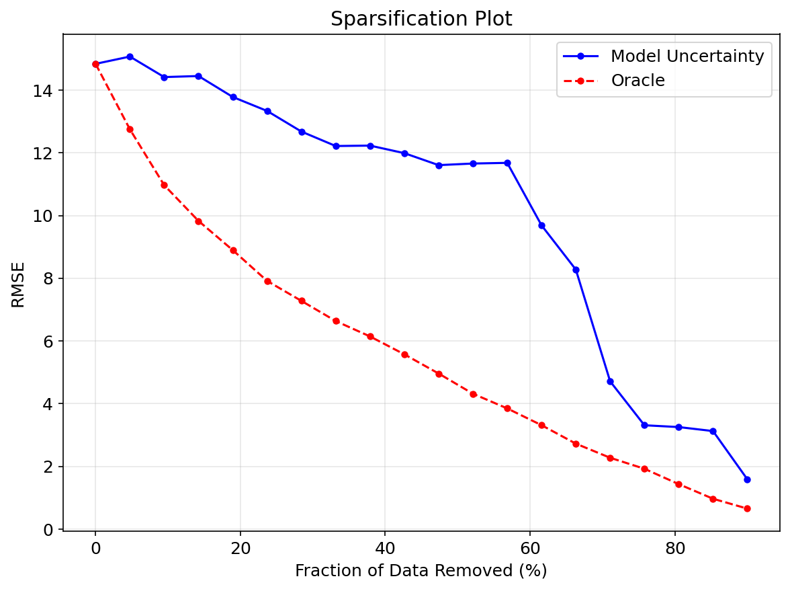
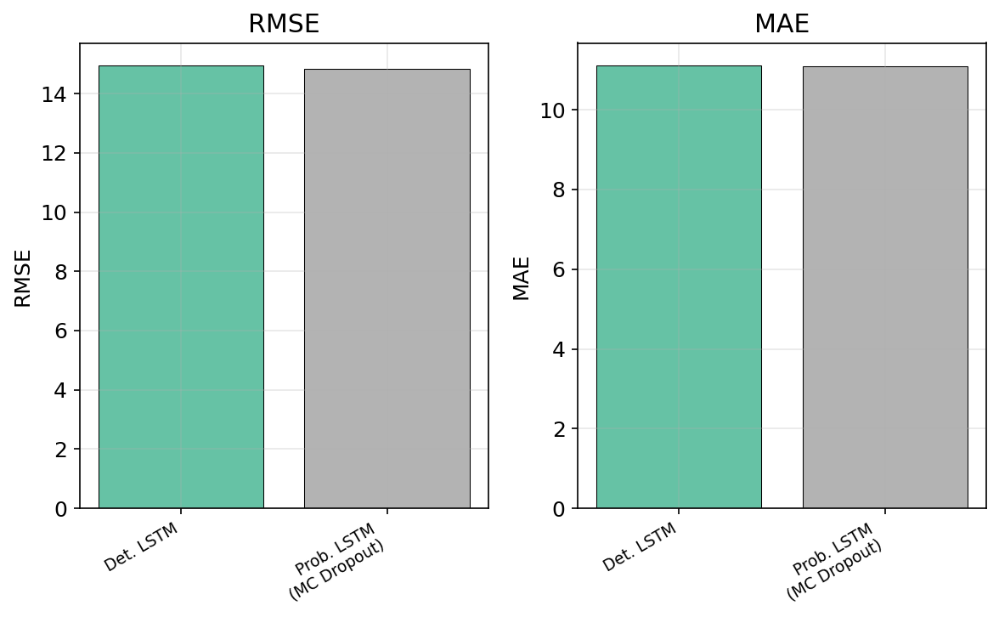

[English](#english) | [中文](#中文)

---

<a id="中文"></a>

# 概率 RUL 预测与不确定性量化

## 项目简介

本项目实现了一个**概率 LSTM** 模型，用于预测涡轮风扇发动机的**剩余使用寿命（RUL）**，并内置**不确定性量化**功能。该项目为 UCL COMP0197 Applied Deep Learning 课程作业。

模型输出高斯分布（均值和标准差）而非单一点估计，并使用 **MC Dropout** 将预测不确定性分解为：

- **偶然不确定性（Aleatoric）** — 数据固有噪声，通过学习的方差捕获
- **认知不确定性（Epistemic）** — 模型不确定性，通过 MC Dropout 采样捕获

## 数据集

**NASA C-MAPSS（商用模块化航空推进系统仿真）— FD001 子集**

| 属性 | 值 |
|------|-----|
| 训练轨迹 | 100 台发动机（完整退化至故障） |
| 测试轨迹 | 100 台发动机（在故障前截断） |
| 运行条件 | 1 种（海平面） |
| 故障模式 | 1 种（HPC 退化） |
| 每时间步传感器数 | 21 个传感器 + 3 个运行设置 |
| 选用特征数 | 14 个（通过标准差 < 0.01 移除常数传感器） |

每行包含 26 列空格分隔数据：`unit_id`、`cycle`、3 个运行设置和 21 个传感器读数。RUL 标签采用分段线性方法构造，上限截断为 125 个周期。

运行 `train.py` 时数据集会从 NASA 开放数据门户自动下载。

## 模型架构

### 概率 LSTM（主模型）

- 2 层 LSTM 编码器，层间带 Dropout
- 两个输出头：**mu**（均值）和 **sigma**（标准差），通过 `exp(log_sigma) + 1e-6` 保证正值
- 使用**高斯负对数似然损失（Gaussian NLL Loss）** 训练
- 测试时进行 **T=100 次 MC Dropout 前向传播**以估计认知不确定性

### 确定性 LSTM（基线模型）

- 相同 LSTM 架构，单输出头
- 使用 **MSE 损失**训练
- 用于消融实验对比

### 超参数

| 参数 | 值 |
|------|-----|
| 序列长度 | 30 |
| 隐藏层维度 | 128 |
| LSTM 层数 | 2 |
| Dropout 比率 | 0.25 |
| 学习率 | 0.001（Adam） |
| 权重衰减 | 1e-4 |
| 批大小 | 32 |
| R_early（RUL 上限） | 125 |
| 学习率调度 | ReduceLROnPlateau（factor=0.5, patience=5） |
| 早停耐心值 | 20 |
| MC Dropout 采样次数 | 100 |

## 实验结果

### 点预测指标

| 模型 | RMSE | MAE | R² | NASA 评分 |
|------|------|-----|-----|----------|
| **概率 LSTM** | **14.84** | **11.08** | **0.872** | **351.07** |
| 确定性 LSTM | 14.96 | 11.12 | 0.870 | 424.06 |

### 不确定性质量指标（概率 LSTM）

| 指标 | 值 |
|------|-----|
| PICP（95% 置信区间覆盖率） | 0.93 |
| MPIW（95% 置信区间宽度） | 51.64 |
| NLL（负对数似然） | 3.02 |
| 平均偶然不确定性标准差 | 12.33 |
| 平均认知不确定性标准差 | 4.38 |
| 平均总不确定性标准差 | 13.17 |

概率模型在获得与确定性模型相当甚至更优的点预测性能的同时，还提供了校准良好的不确定性估计（95% 置信区间实际覆盖率为 93%）。

### 可视化结果

#### 传感器退化趋势图



展示 4 台发动机的关键传感器（s2, s3, s4, s11）随运行周期的变化。传感器读数在发动机寿命末期出现明显上升/偏移趋势，这是模型学习的核心退化信号。不同发动机寿命差异较大（约 150~300 周期）。

#### 训练曲线

| 概率 LSTM | 确定性 LSTM |
|:---------:|:----------:|
|  |  |

概率 LSTM 使用 Gaussian NLL 损失，初始 loss 较高后迅速收敛至 ~2.7，epoch 56 早停；确定性 LSTM 使用 MSE 损失，从 ~4300 下降至 ~140，epoch 44 早停。两者训练/验证曲线贴合良好，无明显过拟合。

#### RUL 预测 vs 真实值散点图

| 概率 LSTM | 确定性 LSTM |
|:---------:|:----------:|
|  |  |

每个点代表一台测试发动机。红色虚线为完美预测。低 RUL 区域（<40）预测准确，紧贴对角线；高 RUL 区域（>80）散布较大且趋向 R_early=125 上限，这是分段线性标签在高 RUL 区信息不足的固有特征。

#### 带不确定性的预测图



样本按真实 RUL 排序。蓝线为预测均值，蓝色阴影为 95% 置信区间（±2σ）。低 RUL 处置信区间窄（模型有信心），高 RUL 处置信区间宽（模型不确定）。绝大多数真实值（黑点）落在阴影内，验证了 PICP=93% 的覆盖率。

#### 不确定性分解图



将总不确定性拆分为两部分：橙色带为**偶然不确定性**（数据噪声，均值 12.33），绿色带为**认知不确定性**（模型不确定性，均值 4.38）。偶然不确定性占主导，说明数据本身的噪声是预测不确定性的主要来源，模型结构已足够捕获退化模式。

#### 校准曲线



X 轴为期望覆盖率，Y 轴为实际覆盖率。蓝线紧贴红色对角线，表明模型的不确定性估计是"诚实的"——预测的置信区间宽度与实际覆盖率吻合良好。

#### 稀疏化图



逐步移除模型认为最不确定的样本后，观察剩余样本的 RMSE。蓝线（模型不确定性）随移除比例增加而下降，且趋势与红线（Oracle，按实际误差排序）一致，说明模型的不确定性估计与实际预测误差正相关——高不确定性确实对应高误差。

#### 消融对比



确定性 LSTM 与概率 LSTM 的 RMSE 和 MAE 对比。两者非常接近（概率模型略优），说明概率模型在不牺牲点预测精度的前提下，额外获得了不确定性量化能力。

## 文献综述

本项目基于概率深度学习与不确定性量化的相关研究，涵盖以下主要方向：

- **数据驱动 RUL 预测演进**：从传统 SVR/HMM 到 CNN、LSTM、Transformer 等深度学习方法，模型性能不断提升
- **不确定性量化方法**：贝叶斯神经网络（BNN）、MC Dropout（Gal & Ghahramani, 2016）、深度集成（Lakshminarayanan et al., 2017）及概率输出头（Nix & Weigend, 1994）
- **RUL 中的不确定性研究**：将 MC Dropout 与概率输出结合，实现偶然-认知不确定性的联合分解（Biggio et al., 2021）

基于文献分析，提出 5 个研究方向：多工况下不确定性校准、不确定性驱动的维护决策优化、不确定性分解指导模型改进、Transformer 架构下的概率预测、以及面向边缘部署的轻量级不确定性量化。

详见完整文献综述：[Literature Review](literature_review.md)

## 使用方法

```bash
# 环境配置
micromamba activate comp0197-pt
pip install matplotlib pandas scikit-learn

# 训练两个模型
python train.py

# 评估并生成图表
python test.py
```

## 项目结构

```
├── train.py              # 训练流程（下载、预处理、训练、保存）
├── test.py               # 评估流程（MC Dropout 推理、指标计算、绘图）
├── models/
│   ├── probabilistic_lstm.py   # 概率 LSTM 模型
│   └── deterministic_lstm.py   # 确定性基线模型
├── utils/
│   ├── data_loader.py    # 数据下载、预处理、Dataset/DataLoader
│   ├── metrics.py        # RMSE、MAE、R²、NASA 评分、PICP、MPIW、NLL、校准曲线
│   ├── visualization.py  # 所有 matplotlib 图表
│   └── helpers.py        # EarlyStopping、随机种子设置
├── saved_models/         # 模型检查点（.pth）
└── results/
    ├── figures/          # 生成的 PNG 图表
    └── metrics.json      # 量化结果
```

---

<a id="english"></a>

# Probabilistic RUL Prediction with Uncertainty Quantification

## Project Overview

This project implements a **Probabilistic LSTM** model for predicting the **Remaining Useful Life (RUL)** of turbofan engines, with built-in **uncertainty quantification**. It is developed as part of the UCL COMP0197 Applied Deep Learning coursework.

The model outputs a Gaussian distribution (mean and standard deviation) rather than a single point estimate, and uses **MC Dropout** to decompose predictive uncertainty into:

- **Aleatoric uncertainty** — inherent data noise, captured by the learned variance
- **Epistemic uncertainty** — model uncertainty, captured by MC Dropout sampling

## Dataset

**NASA C-MAPSS (Commercial Modular Aero-Propulsion System Simulation) — FD001 subset**

| Property | Value |
|----------|-------|
| Training trajectories | 100 engines (run-to-failure) |
| Test trajectories | 100 engines (truncated before failure) |
| Operating conditions | 1 (sea level) |
| Fault modes | 1 (HPC degradation) |
| Sensors per timestep | 21 sensors + 3 operational settings |
| Selected features | 14 (constant sensors removed by std < 0.01) |

Each row contains 26 space-separated columns: `unit_id`, `cycle`, 3 operational settings, and 21 sensor readings. RUL labels are constructed using a piece-wise linear scheme with an upper bound of 125 cycles.

The dataset is automatically downloaded from NASA Open Data Portal when running `train.py`.

## Model Architecture

### Probabilistic LSTM (Main Model)

- 2-layer LSTM encoder with dropout between layers
- Two output heads: **mu** (mean) and **sigma** (std) via `exp(log_sigma) + 1e-6`
- Trained with **Gaussian Negative Log-Likelihood Loss**
- At test time, runs **T=100 MC Dropout forward passes** to estimate epistemic uncertainty

### Deterministic LSTM (Baseline)

- Same LSTM architecture, single output head
- Trained with **MSE Loss**
- Used for ablation comparison

### Hyperparameters

| Parameter | Value |
|-----------|-------|
| Sequence length | 30 |
| Hidden dimension | 128 |
| LSTM layers | 2 |
| Dropout | 0.25 |
| Learning rate | 0.001 (Adam) |
| Weight decay | 1e-4 |
| Batch size | 32 |
| R_early (RUL cap) | 125 |
| LR scheduler | ReduceLROnPlateau (factor=0.5, patience=5) |
| Early stopping patience | 20 |
| MC Dropout samples | 100 |

## Results

### Point Prediction Metrics

| Model | RMSE | MAE | R² | NASA Score |
|-------|------|-----|-----|------------|
| **Probabilistic LSTM** | **14.84** | **11.08** | **0.872** | **351.07** |
| Deterministic LSTM | 14.96 | 11.12 | 0.870 | 424.06 |

### Uncertainty Quality Metrics (Probabilistic LSTM)

| Metric | Value |
|--------|-------|
| PICP (95% CI) | 0.93 |
| MPIW (95% CI) | 51.64 |
| NLL | 3.02 |
| Mean Aleatoric Std | 12.33 |
| Mean Epistemic Std | 4.38 |
| Mean Total Std | 13.17 |

The probabilistic model achieves competitive point prediction performance while providing calibrated uncertainty estimates (93% coverage for 95% confidence intervals).

### Visualization

#### Sensor Degradation Trends


Shows 4 key sensors (s2, s3, s4, s11) across 4 engines over their operating cycles. Sensor readings exhibit clear upward drift near end-of-life, which is the core degradation signal the model learns from. Engine lifespans vary significantly (~150–300 cycles).

#### Training Curves

| Probabilistic LSTM | Deterministic LSTM |
|:-------------------:|:------------------:|
|  |  |

The probabilistic LSTM (Gaussian NLL loss) converges quickly from ~46 to ~2.7, early-stopped at epoch 56. The deterministic LSTM (MSE loss) drops from ~4300 to ~140, early-stopped at epoch 44. Both show well-matched train/val curves with no significant overfitting.

#### RUL Prediction vs Ground Truth

| Probabilistic LSTM | Deterministic LSTM |
|:-------------------:|:------------------:|
|  |  |

Each point represents one test engine. The red dashed line indicates perfect prediction. Low RUL predictions (<40) are accurate and tightly clustered around the diagonal. High RUL predictions (>80) show more scatter and tend toward the R_early=125 cap — a known artifact of the piece-wise linear labeling scheme.

#### Predictions with Uncertainty Bands


Samples sorted by true RUL. Blue line is the predicted mean; blue shaded region is the 95% confidence interval (±2σ). Confidence intervals are narrow for low RUL (high model confidence) and wide for high RUL (high uncertainty). Most ground truth values (black dots) fall within the shaded band, consistent with the 93% PICP.

#### Uncertainty Decomposition


Total uncertainty decomposed into: orange band = **aleatoric** (data noise, mean std 12.33) and green band = **epistemic** (model uncertainty, mean std 4.38). Aleatoric uncertainty dominates, indicating that inherent data noise is the primary source of prediction uncertainty, while the model architecture sufficiently captures degradation patterns.

#### Calibration Plot


Expected coverage (x-axis) vs actual coverage (y-axis). The blue curve closely follows the red diagonal (perfect calibration), demonstrating that the model's uncertainty estimates are well-calibrated — predicted confidence intervals match their intended coverage levels.

#### Sparsification Plot


RMSE computed on remaining samples after progressively removing the most uncertain predictions. The blue curve (model uncertainty) decreases consistently and follows the same trend as the red curve (oracle, sorted by actual error), confirming that higher predicted uncertainty correlates with larger actual prediction errors.

#### Ablation Comparison


Side-by-side RMSE and MAE comparison between deterministic and probabilistic LSTM. Both metrics are nearly identical (probabilistic slightly better), demonstrating that the probabilistic model provides uncertainty quantification without sacrificing point prediction accuracy.

## Literature Review

This project builds upon research in probabilistic deep learning and uncertainty quantification, covering:

- **Evolution of data-driven RUL prediction**: From traditional SVR/HMM to deep learning approaches including CNN, LSTM, and Transformer architectures
- **Uncertainty quantification methods**: Bayesian Neural Networks, MC Dropout (Gal & Ghahramani, 2016), Deep Ensembles (Lakshminarayanan et al., 2017), and probabilistic output heads (Nix & Weigend, 1994)
- **Uncertainty in RUL prediction**: Combining MC Dropout with probabilistic outputs for joint aleatoric-epistemic uncertainty decomposition (Biggio et al., 2021)

Five research questions are proposed: uncertainty calibration under multiple operating conditions, uncertainty-driven maintenance decision optimization, uncertainty decomposition for model improvement guidance, probabilistic prediction with Transformer architectures, and lightweight UQ methods for edge deployment.

Full literature review: [Literature Review](literature_review.md)

## Usage

```bash
# Environment setup
micromamba activate comp0197-pt
pip install matplotlib pandas scikit-learn

# Train both models
python train.py

# Evaluate and generate figures
python test.py
```

## Project Structure

```
├── train.py              # Training pipeline (download, preprocess, train, save)
├── test.py               # Evaluation pipeline (MC Dropout inference, metrics, plots)
├── models/
│   ├── probabilistic_lstm.py
│   └── deterministic_lstm.py
├── utils/
│   ├── data_loader.py    # Data download, preprocessing, Dataset/DataLoader
│   ├── metrics.py        # RMSE, MAE, R², NASA Score, PICP, MPIW, NLL, calibration
│   ├── visualization.py  # All matplotlib figures
│   └── helpers.py        # EarlyStopping, seed setup
├── saved_models/         # Model checkpoints (.pth)
└── results/
    ├── figures/          # Generated PNG plots
    └── metrics.json      # Quantitative results
```
